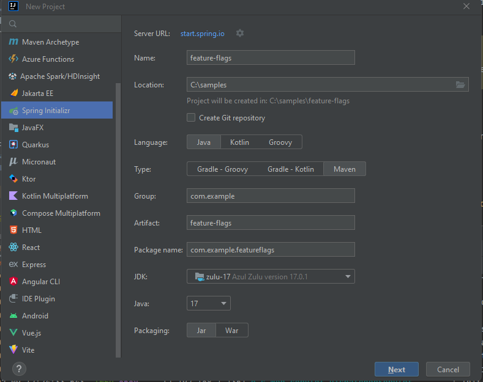
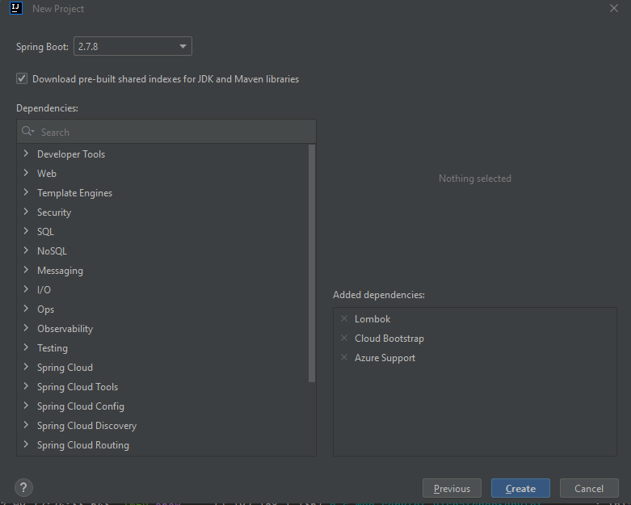

# Using Azure Feature Flags in a Spring Boot application

Feature Management is a modern practice to remove hardened relationships between code deployment and releases. It allows applications to be deployed in a scheduled manner and the new features to be toggled on at a determined time. To support Feature Management in Azure, Feature Flags can be used and can be administrated through Azure App Configuration.

In this tutorial we'll show you how to utilize App Configuration to support Feature Flags. A Feature Flag will be used to determine which method to process incoming traffic to an endpoint and route it appropriately.

## Setting up your project

- First, we are going to create a new repository with the necessary dependencies. If you do not have IntelliJ, navigate to the Spring Initializr page, [start.spring.io](start.spring.io). In IntelliJ, choose File -> New -> Project and select Spring Initializr.
- Add your project information into the form, I am using a Maven project, but I do supply the Gradle snippets in this tutorial if that is your preference:



- For the version of Java, use the latest Spring Boot 2 version, as of this time 2.7.8 is the latest. This tutorial will be updated for Spring Boot 3 in the future. For dependencies, select Lombok, Cloud Bootstrap and Azure Support. Since you have selected a Spring Boot 2 version, Initializr will provide the appropriate dependencies:



- Now we are able to begin the tutorial.

## Adding the Feature Flags to Azure

- As mentioned,Azure App Configurationprovides a convenient solution for maintaining Feature Flags. In this tutorial we will be using two App Configurations for responding to the request, a Feature Flag and a sentinel key used for the application to receive updates when a key and/or Feature Flag is updated.
- In your *App Configuration* resource, using the **Configuration Explorer** in the Portal, create the following keys and add some values:
  - **/ff-demo/content.value1**, the DTO has a field named question that this maps to
  - **/ff-demo/content.value2** the DTO has a field named answer that this maps to
  - **sentinel-keys** will be used as a trigger when something in App Configuration gets updated
- Now in the Portal select **Feature manager** and then **Create**. This will take you to a form to create a new Feature Flag. For the Feature flag name type "**DemoFlag**". For purposes of this tutorial, do not click the Enable feature flag radio button…yet. For this tutorial, there is no need to worry about populating the remaining form, so just click **Apply**.
- While you are in *App Configuration*, go to the **Access Keys** and copy the *Connection string* value. If you are interested in using the App Configuration Endpoint and a token rather than the connection string, you can review my blog about that located **[here](https://3cloudsolutions.com/resources/bootstrapping-azure-app-configuration-and-key-vault-in-a-spring-boot-application/)**, but for now we will just use connection string for simplicity.
- We are now ready to start adding code.

## Updating your dependencies

- Most of the dependencies required are already available in the BOMs we downloaded as part of Spring Initializr. However, there are 2 that are not that need to be added.
- If you are using Maven, add the following to your pom.xml:
```xml
<dependency>
    <groupId>com.azure.spring</groupId>
    <artifactId>azure-spring-cloud-starter-appconfiguration-config</artifactId>
    <version>2.11.0</version>
</dependency>
<dependency>
    <groupId>com.azure.spring</groupId>
    <artifactId>azure-spring-cloud-feature-management-web</artifactId>
    <version>2.10.0</version>
</dependency>
<dependency>
    <groupId>org.springframework.boot</groupId>
    <artifactId>spring-boot-configuration-processor</artifactId>
    <optional>true</optional>
</dependency>
<dependency>
    <groupId>org.springframework.boot</groupId>
    <artifactId>spring-boot-starter-web</artifactId>
</dependency>
 ```

- If you are using Gradle, add the following to your build.gradle:
```groovy
implementation 'org.springframework.boot:spring-boot-starter-web'
implementation 'com.azure.spring:azure-spring-cloud-starter-appconfiguration-config:2.11.0'
implementation 'com.azure.spring:azure-spring-cloud-feature-management-web:2.10.0'
annotationProcessor 'org.springframework.boot:spring-boot-configuration-processor'
```


- Load your changes after adding those in order to download the dependencies.

## Create a Model and DTO

- Our model will be populated with App Configuration values with the prefix of **"content"**
- Since we added Project Lombok while in Spring Initialzr, we will utilize Lombok's annotations to make simple classes.
- Create a new class named DemoValue and paste the following:
```java
@Data
public class DemoValueDTO {
    private String question;
    private String answer;
    private String featureFlagStatus;

    public DemoValueDTO(DemoValue demoValue){
        this.question = demoValue.getValue1();
        this.answer = demoValue.getValue2();
    }
}
```
- Create another new class named DemoValueDTO and paste the following:
```java
@Configuration
@ConfigurationProperties("content")
@Getter
@Setter
public class DemoValue {
    private String value1;
    private String value2;
}
```


- As you can see, we will be injecting this DTO with our data model via the constructor. The **@Data** annotation is a Project Lombok convenience annotation for bundling all the boilerplate of a POJO 

- Now that we have our data model created, we need to make the application aware so that it gets populated during startup. In your Application class, add the @EnableConfigurationProperties annotation as follows:
```java
@SpringBootApplication
@EnableConfigurationProperties({DemoValue.class})
public class AppConfigFeatureflagsApplication {

  public static void main(String[] args) {
    SpringApplication.run(AppConfigFeatureflagsApplication.class, args);
  }
}
```


## Creating the bootstrap file

- If you have created the App Configuration keys as mentioned above, you should be able to copy and paste the content in this section into a bootstrap.yml file.
- First off, create an environment variable named **APP_CONFIGURATION_CONNECTION_STRING** and populate it with the connection string that you copied above. When I am using Environment variables in IntelliJ I create them using *Run Configurations* to make it easier to manage over many applications.
- Now that we have the variable we can reference it; so lets create a new file named bootstrap.yml in your resources folder, and paste in the following text:
```yaml
spring:
cloud:
azure:
appconfiguration:
enabled: true
stores:
 - connection-string: ${APP_CONFIGURATION_CONNECTION_STRING}
monitoring:
enabled: true
refresh-interval: 20s
triggers:
 - key: sentinel-keys
selects:
 - key-filter: /ff-demo/
feature-flags:
enabled: true
```

- If you created the App Config entries following the directions above, the key-filter will work, if you want to change the key filter, you will also need to create new key-values in App Configuration. It is expected that keys in App Configuration that do not have a filter be created as /application/[prefix].[key]
- Thesentinel-keyskey here is the key that triggers the application to fetch changes.

## Creating the Controller

- Now we have everything ready to start working on the controller. In my example I am using Reactive endpoints.
- In your controller, add private fields for **FeatureManager** and your **DemoValue** model and utilize constructor injection to populate them. I am also creating an instance of an **ObjectMapper** to return JSON, but that part is not necessary.

```java
@RestController
public class FeatureFlagsController {

    private DemoValue demoValue;
    private FeatureManager featureManager;
    private ObjectMapper objectMapper = new ObjectMapper().enable(SerializationFeature.INDENTOUTPUT);

    public FeatureFlagsController(DemoValue demoValue,
                    FeatureManager featureManager) {
        this.demoValue = demoValue;
        this.featureManager = featureManager;
    }
```

- Since I am using ObjectMapper, I have also created a private convenience method to do the serialization as follows:
```java
    private String toJson(Object object) throws JsonProcessingException {
        objectMapper.configure(SerializationFeature.FAILONEMPTYBEANS, false);
        objectMapper.setVisibility(PropertyAccessor.FIELD, JsonAutoDetect.Visibility.ANY);
        return objectMapper.writeValueAsString(object);
    }
```

- Let's create a simple GET endpoint, named **"/hellooff"** that will manage requests without the Feature Flag being enabled, you can see that I am calling my private method to generate the JSON response:
```java
    @GetMapping(value = "/helloff", produces =APPLICATIONJSONVALUE)
    public Mono<String> getHelloOff() throws             JsonProcessingException {
        DemoValueDTO demoValueDTO = new DemoValueDTO(demoValue);
        demoValueDTO.setFeatureFlagStatus("the feature flag is not enabled");
        return Mono.just(toJson(demoValueDTO));
    }
```
    
- Now it's time to create the main GET endpoint that will serve requests to **"/hello"** and process them according to the state of the Feature Flag.
- Create your @GetMapping annotation, and for its value set both **"/hello"** and **"/hellon"**. This is done by wrapping the comma delimited values in braces.
- We will use a different annotation, named **@FeatureGate** for using the Feature Flag state for routing. How this works is that if the feature defined in the annotation **("DemoFlag")** is enabled, then the method can be called, if it is disabled it will instead hand off the request to the endpoint defined as it's fallback. Here is how it should look:

```java 
    @GetMapping(value = {"/hello", "/hellon"}, produces =APPLICATIONJSONVALUE)
    @FeatureGate(feature = "DemoFlag", fallback = "/helloff")
    public Mono<String> getHelloOn() throws JsonProcessingException {
        DemoValueDTO demoValueDTO = new DemoValueDTO(demoValue);
        demoValueDTO.setFeatureFlagStatus("the feature flag is enabled");
        return Mono.just(toJson(demoValueDTO));
    }
```

## Time to test

- Start the application up, I have my server port set to 8082, and run the following cURL command:

```cURL
curl --location --request GET 'localhost:8082/hello'
```
- You should get a response as follows:
```cURL
$ curl --location --request GET 'localhost:8082/hello'
{
    "question" : "how are ya now?",
    "answer" : "not too bad, 'n you?",
    "featureFlagStatus" : "the feature flag is not enabled"
}
```

- Now go to the Feature Manager section of the Portal and Click the radio button to enable the Feature Flag, then go to Configuration explorer and update the value of sentinel-keys to trigger the update and run the same cURL command and you should see the following: 
```cURL
$ curl --location --request GET 'localhost:8082/hello'
{
    "question" : "how are ya now?",
    "answer" : "not too bad, 'n you?",
    "featureFlagStatus" : "the feature flag is not enabled"
}
```

- Note that sometimes you may need to consume the service a second time for the change to take effect.

## Summary

I hope that this tutorial was useful, even though simplistic. As mentioned earlier, you can follow my previous blog regarding bootstrapping Azure App Configuration and Key Vault and add the Feature Flag functionality to it. That allows the use of Tokenized Authentication and using the endpoint of the App Configuration store.

A full version of this blog can be found on Github at .