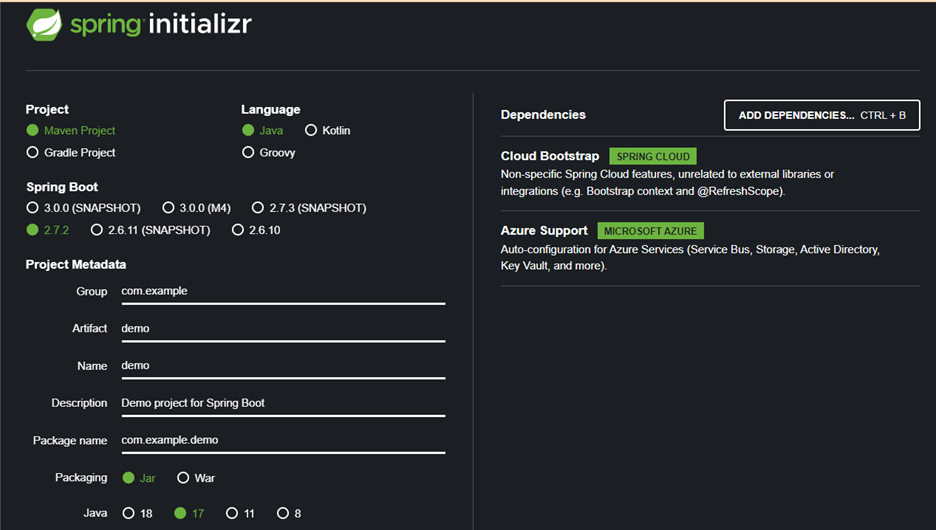

# Bootstrapping Azure App Configuration and Key Vault in a Spring Boot Application

Azure Key Vault is a cloud service that provides secure storage and access to secrets.  Azure App Configuration is a cloud service that provides access to centrally managed application settings and provides an interface for fetching Azure Key Vault secrets. 

In this tutorial we’ll show how you can utilize Azure App Configuration to fetch application configurations and secrets on startup and when they are updated.  The completed application can be run in Azure using Managed Identity as well as locally on a desktop without any code changes.

## Setting up your project
* First we are going to create a new repository with the necessary dependencies.  If you do not have IntelliJ, navigate to the Spring Initilizr page, [start.spring.io](start.spring.io).  In IntelliJ, choose File -> New -> Project and select Spring Initializr.
* Enter in your project information, in this tutorial we are using Spring Boot 2.7.2 and Java 17.  The version of Spring Boot does need to be greater than 2.6.0 for support.
* In your dependencies section, you will want “Cloud Bootstrap” and “Azure Support”.  These are 2 BOMs that contain dependencies needed to support this tutorial.

* If you are using the browser, download the zip file, decompress it and open up the created project.  If you are using IntelliJ, after you add the dependencies, just click “Create.”  We now have a project that is ready to utilize Spring Cloud and Azure.

## Updating your pom.xml
* For this tutorial, the spring-boot-starter-test dependency isn’t necessary, so it can be removed.
* Add the following dependency to your pom.xml:
```
<dependency>
    <groupId>com.azure.spring</groupId>
    <artifactId>azure-spring-cloud-starter-appconfiguration-config</artifactId>
    <version>2.8.0</version>
</dependency>
```
* The azure-spring-cloud-starter-appconfiguration-config dependency will allow us to use a credential provider to authenticate against the Azure App Configuration endpoint.

## Creating POJOs to store Azure App Configuration key values
* In this tutorial, we will use 3 POJOs to show how prefixes can be utilized in Azure App Configuration.  The POJOs are named ValuesConfig, AdditionalValuesConfig and MoreValuesConfig.  They all will share the same fields for simplicity - textValue, integerValue and secret.
* Create the private members and create the necessary getters and setters for them in each class.  If you are using **Project Lombok**, using **@Getter** and **@Setter** annotations will suffice.
* For simplicity of the controllers, I am using 2 methods in each of the POJOs so that I do not need to introduce a DTO layer into this tutorial.  These 2 methods are as follows:
```
public String toJson() {
    JSONObject json = new JSONObject();
    json.put("textValue", this.textValue);
    json.put("integerValue", this.integerValue);
    json.put("secret", this.secret);
    return json.toJSONString();
}

public JSONObject toJsonObject() {
    JSONObject json = new JSONObject();
    json.put("textValue", this.textValue);
    json.put("integerValue", this.integerValue);
    json.put("secret", this.secret);
    return json;
}
```
* Add the **@Configuration** class-level annotation to each POJO.
* Another class-level annotation will also be added to each POJO, **@ConfigurationProperties**.  This annotation can accept parameters, will want to use the prefix annotation to allow the POJO to be populated with the correct prefixed key value.  Please update the POJOs as follows:
```
@Configuration
@ConfigurationProperties(prefix = "one")
public class ValuesConfig {

…

@Configuration
@ConfigurationProperties(prefix = "two")
public class MoreValuesConfig {

…

@Configuration
@ConfigurationProperties(prefix = "three")
public class AdditionalValuesConfig {
```
* Finally, we need to make the application aware of these configurations.  To do this, open your application class and add the **@EnableConfigurationProperties** annotation with a list of these classes as arguments as so:
```
@SpringBootApplication
@EnableConfigurationProperties({ValuesConfig.class, MoreValuesConfig.class, AdditionalValuesConfig.class})
public class AppConfigKeyvaultApp {
```
* We now have POJOs that are prepared to have Azure App Configuration and Key Vault injected into them on startup.

## Configuring the application
* •	Now that we have our objects prepared to be injected with values from Azure App Configuration and Key Vault, it is time to configure the application.
* We want our application to be able to run locally pulling the same configurations and secrets as they would running in a container on Azure with Managed Identity enabled, to do so, we need to create a class that obtains a valid token to the resources.
* The azure-identity dependency that is included in the Azure BOM does just that, and there are two interfaces included in the *azure-spring-cloud-starter-appconfiguration-config* that we added to the pom that use the tokens to access Azure App Configuration and Key Vault.
* Create a new class named AzureCredentials and paste in the following code:
```
public class AzureCredentials implements AppConfigurationCredentialProvider, KeyVaultCredentialProvider {

    @Override
    public TokenCredential getKeyVaultCredential(String uri) {
         return getCredential();
    }

    @Override
    public TokenCredential getAppConfigCredential(String uri) {
         return getCredential();
    }

    public TokenCredential getCredential()  {
       return new DefaultAzureCredentialBuilder().build();
    }
```
* Next, we want to create a bean to expose this class on startup, so create a new class, named AzureBootConfig and paste in the following:
```
@Configuration
public class AzureBootConfig {

    @Bean
    public AzureCredentials azureCredentials() {
        return new AzureCredentials();
    }
}
```
* Now we can bootstrap this configuration class using a Spring Factory.  To do so, under your resources folder create a folder named **META-INF**.  Inside that folder create a file named **spring.factories** and paste the following into the new file using the package name of where you created the AzureBootConfig class:
```
org.springframework.cloud.bootstrap.BootstrapConfiguration=\
com.my.package.name.AzureBootConfig
```

## Creating the controller
* In this tutorial we will create endpoints to return our App Configuration and Key Vault values.  
* To accommodate an endpoint to return all 3 of the POJO objects, I created a simple **@Service** named Response as follows with the classes injected via constructor injection:
```
@Service
public class Response {

    private ValuesConfig valuesConfig;
    private MoreValuesConfig moreValuesConfig;
    private AdditionalValuesConfig additionalValuesConfig;

    public Response(ValuesConfig valuesConfig, 
                    MoreValuesConfig moreValuesConfig,
                    AdditionalValuesConfig additionalValuesConfig) {
        this.valuesConfig = valuesConfig;
        this.moreValuesConfig = moreValuesConfig;
        this.additionalValuesConfig = additionalValuesConfig;
    }

    public String toJson() throws JsonProcessingException {
        JSONObject obj = new JSONObject();
        obj.put("Values", valuesConfig.toJsonObject());
        obj.put("MoreValues", moreValuesConfig.toJsonObject());
        obj.put("AdditionalValues", additionalValuesConfig.toJsonObject());
        return obj.toJSONString();
    }
}
```
* In the controller, we need to inject the POJOs as well as the service:
```
private ValuesConfig valuesConfig;
private MoreValuesConfig moreValuesConfig;
private AdditionalValuesConfig additionalValuesConfig;
private Response response;

public AppConfigController(ValuesConfig valuesConfig,
                           MoreValuesConfig moreValuesConfig,
                           AdditionalValuesConfig additionalValuesConfig,
                           Response response) {
    this.additionalValuesConfig = additionalValuesConfig;
    this.valuesConfig = valuesConfig;
    this.moreValuesConfig = moreValuesConfig;
    this.response = response;
}
```
* Now we can create an endpoint for each of the configuration classes individually and one for a collection of all 3.
```
@GetMapping(value = "/values", produces = APPLICATION_NDJSON_VALUE)
public Mono<String> getValues() throws JsonProcessingException {
    return Mono.just(this.valuesConfig.toJson());
}

@GetMapping(value = "/moreValues", produces = APPLICATION_NDJSON_VALUE)
public Mono<String> getMoreValues() throws JsonProcessingException {
    return Mono.just(this.moreValuesConfig.toJson());
}

@GetMapping(value = "/additionalValues", produces = APPLICATION_NDJSON_VALUE)
public Mono<String> getAdditionalValues() throws JsonProcessingException {
    return Mono.just(this.additionalValuesConfig.toJson());
}

@GetMapping(value = "/allConfigs", produces = APPLICATION_NDJSON_VALUE)
public Flux<String> getConfigsFlux() throws JsonProcessingException {
    return Flux.just(response.toJson());
}
```
* As a note, to utilize APPLICATION_NDJSON_VALUE, statically import  org.springframework.http.MediaType.* into your controller.

## Updating the bootstrap file
* In this tutorial we are using YAML files, you can substitute property files instead.
* All of the properties used in the Azure App Configuration BOM can be found here with more verbose descriptions, we will be using these in our bootstrap file.
* Copy and paste the following YAML into your bootstrap.yml file, we will utilize the commented section towards the end of this tutorial:
```
spring:
  cloud:
    azure:
      appconfiguration:
        enabled: true
        stores:
          -
            endpoint: ${APP_CONFIGURATION_ENDPOINT}
            monitoring:
              enabled: true
              refresh-interval: 20s
              triggers:
                - 
                  key: sentinel-keys
            #selects:
            #  -
            #    key-filter: /demofilter/
```
* When we run this sample, we will populate the environment variable named APP_CONFIGURATION_ENDPOINT.

## Setting up Azure App Configuration and Key Vault
* In your Key Vault instance, make sure that you have roles for Key Vault Contributor, Key Vault Secrets User and Key Vault Reader.
* We are going to create 3 secrets, secret-one, secret-two, and secret-three.  They can be valued at whatever you like.
* In App Configuration, make sure that you have roles for App Configuration Data Owner and App Configuration Data Reader.
* The expected format for a key value in App Configuration is **/[filter]/[prefix].[key]**, where filter by default is **“application”** and prefix are the string values that you created in the POJOs.  Also note that the Azure library will attempt to translate the key literals into camel casing, so using hyphens for the key names is a good practice that you will not need to worry about managing in your POJO; for example, **“key-value”** would expect a field name in the POJO of **“keyValue”**.
* So in Configuration Explorer of App Configuration, click Create -> Key-value and enter string values for the following keys:
  *	/application/one.text-value
  *	/application/two.text-value
  *	/application/three.text-value
* Enter integer values for the following keys:
  *	/application/one.integer-value
  *	/application/two.integer-value
  *	/application/three.integer-value
* For the secret values, you will choose Create -> Key Vault reference, after you enter a name of the key, select your Key Vault from the drop-down, and then your secret from the secret drop-down.  Create the following Key Vault references:
  *	/application/one.secret  secret-one
  *	/application/two.secret  secret-two
  *	/application/three.secret  secret-three
* Finally, we will need to create an entry for our trigger when a key is updated.  Create a key named sentinel-keys and leave it unvalued for now.
* Navigate to Overview of App Configuration, and copy the value from Endpoint, it should look something like this:  **https://[app-config-name].azconfig.io**

## Running the sample
* Create an environment variable named APP_CONFIGURATION_ENDPOINT and set it equal to the endpoint value that you copied from App Configuration.
* Open up an Azure CLI instance and log into your subscription that is hosting App Configuration.
* Run the sample, you should see the DefaultCredentialBuilder navigating through different tokens to try to find one with access to the App Configuration instance in the console.
* If you are running the sample in your IDE and having issues connecting, you may need to restart your IDE to pull in the changes after you logged in via Azure CLI.
* If you are still having issues, verify that the roles for both App Configuration and Key Vault are correct.
* You can now utilize Postman or curl to connect to the endpoints and receive JSON back.
* To test value refreshing, edit the value of a key.  After you save this entry, change the value of **sentinel-keys** to some value like date and time.  Consume an endpoint and the console should show values getting updated, consume the appropriate endpoint for the property that you changed and you should see the updated value.

## Using key filters
* Key filters allow applications to pull from App Configuration using filters to easily separate App Configuration values for multiple applications.  In the keys, filters replace the literal **“application”** in the name.  In the commented portion of the *bootstrap.yml* file above, uncomment the 3 lines that are commented to enable this.
* In App Configuration, re-create the keys listed above, with the exception of sentinel-keys, replacing **“/application/” with “/demofilter/”** and re-start your application, it should now pull values using this filter.

## Summary
I hope that this tutorial was useful.  Please note that if you do not want to use a credential provider to access App Configuration via its Endpoint, you can use the Connection String.  To do so, in the *bootstrap.yml* file, replace the **“endpoint”** key with **“connection-string”** and update your environment variable to the connection string value.
Also note that if using App Configuration on a developer machine doesn’t make sense to your organization, changing the value of enabled to be false will disable the fetching of values, and the application will expect an application.yml file to exist with the key values.

A full version of the source code can be found on Github at [https://github.com/3CloudSolutions/asd-oss-blogs/tree/main/app-config-keyvault-spring-sample](https://github.com/3CloudSolutions/asd-oss-blogs/tree/main/app-config-keyvault-spring-sample)
